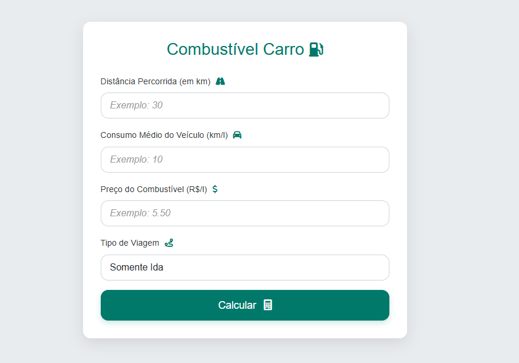

# Calculadora de Combustível

A **Calculadora de Combustível** é uma ferramenta web que permite estimar o custo de uma viagem de carro com base em dados fornecidos pelo usuário. Com ela, é possível calcular o valor gasto com combustível considerando o tipo de combustível (álcool, gasolina ou diesel), o preço por litro, a distância percorrida e o consumo médio do veículo.

## Cálculo:
O cálculo começa com a definição do consumo médio do veículo, que varia conforme o tipo de combustível. Com esse dado, calcula-se a quantidade de litros necessários para percorrer a distância informada. O custo da viagem é obtido multiplicando a quantidade de litros pelo preço do combustível. Para viagens de ida e volta, o cálculo é feito para a distância total (ida e volta), dobrando a quantidade de litros necessários e, consequentemente, o custo total. O resultado fornece o Custo da Ida e o Custo Total (Ida e Volta).

Essa ferramenta é útil para motoristas que desejam planejar seus custos de viagem com mais precisão, considerando diferentes tipos de combustível e variáveis como distância e consumo do veículo.

## Tecnologias Utilizadas:
- HTML
- CSS
- JavaScript# Fuel-CalculatorX
